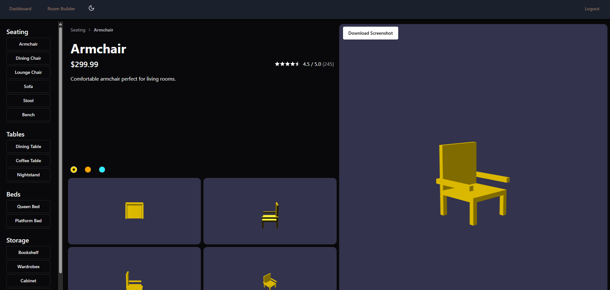
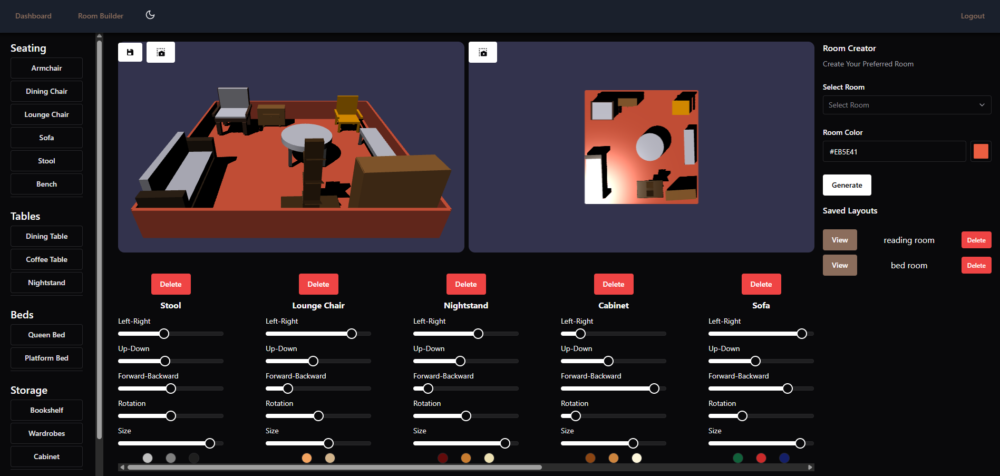

# 🪑 Furniture Store – Interactive 3D Room Builder

A web-based interactive furniture store application built for the HCI coursework. Users can explore 3D furniture, customize rooms, and save their designs with real-time interactions.

## 🚀 Features

- 🧩 **3D Furniture Viewer** – View detailed 3D furniture models.
- 🎨 **Color Customization** – Change the color of each item.
- 🌀 **Angle-Based Viewing** – Click to rotate and view furniture from different angles.
- 🏠 **Room Builder**:
  - Select room type.
  - Set dimensions (width, height, length, color).
  - Add, move, rotate, resize, and recolor furniture items.
  - Save your room layout for future use.
- 💾 **Persistent Design Editor** – Load and modify saved designs anytime.

## 🛠️ Technologies Used

- **React.js** – Frontend Framework
- **Chakra UI** – UI Components and Styling
- **Babylon.js** – 3D Rendering Engine
- **Zustand** – State Management
- **React Router** – Routing and Navigation

## 📷 Screenshots & Demo

### 🖼 3D Furniture Viewer



### 🛠 Room Builder Interface



## 🧪 How to Run the Project

1. **Fork or Clone the Repository**

   ```bash
   git clone https://github.com/Nipun-Malingafurniture-store.git
   cd furniture-store
   ```

2. **Install Dependencies**

   ```bash
   npm install
   npm run dev
   ```

3. **Login Credentials**
   ```bash
   Email: admin@example.com
   Password: admin123
   ```
